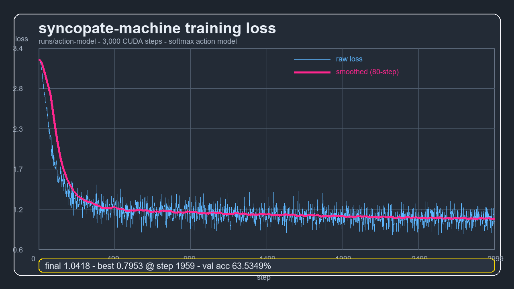

# syncopate-machine ⚡

Tiny Burn transformer for **Dancing With My Code** chat and his game. It predicts action IDs,
then the website response graph turns those actions into short Thai/English
messages and mood GIFs. Small brain, fast vibes.

```text
user text -> website classifier -> [action_id, lang_id, SEP]
          -> syncopate-machine -> next action IDs
          -> response graph -> message + mood GIF
```

## Quick Start 🚀

Build the action data:

```powershell
python examples\build_action_data.py --offline
```

Train on CUDA:

```powershell
cargo run --release --features cuda --example train_action_model -- `
  --steps 3000 --batch-size 32 --lr 0.003 `
  --checkpoint-dir runs/action-model
```

Ship these into the website:

```text
dancing-with-my-code-v2/assets/model-personal-v2.mpk
dancing-with-my-code-v2/assets/model-config-personal-v2.json
```

## Model Vibe 🧠

| Setting | Value |
| --- | --- |
| Task | causal action-sequence prediction |
| Vocab | 23 action/lang/control IDs |
| Sequence length | 64 |
| Layers | 1 |
| d_model | 64 |
| Attention | causal scaled dot-product softmax |
| Attention heads | 4 |
| KV heads | 1 |
| FFN | SwiGLU, width 64 |
| Position encoding | RoPE |
| Norm | RMSNorm |
| Output projection | tied to embedding |
| Params | 24,192 |

## Current Checkpoint 💾

The website uses:

```text
runs/action-model/final.mpk
```

Current validation metrics:

| Metric | Value |
| --- | --- |
| Validation loss | 1.113533 |
| Validation perplexity | 3.0451 |
| Validation accuracy | 63.5349% |

## Training Loss 📉



Raw loss is noisy because the batches are tiny. The pink line is an 80-step
smooth, which shows the real shape: hard drop early, then slow grind.

## Browser Runtime 🌐

| Mode | Behavior |
| --- | --- |
| `auto` | try WebGPU, fall back to CPU |
| `gpu` | require WebGPU |
| `cpu` | force CPU/Flex backend |

MIT. Break it, fix it, ship it. ✨
